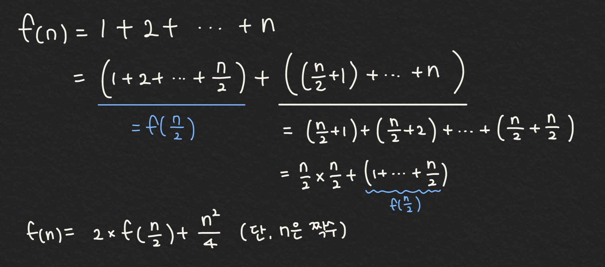

# 분할 정복(Divide & Conquer)

> 주어진 문제를 둘 이상의 부분 문제로 나눈 뒤 각 문제에 대한 답을 재귀 호출을 이용해 계산하고, 각 부분 문제의 답으로부터 전체 문제의 답을 계산

- 일반적인 재귀 호출은 문제를 한 조각과 나머지 전체로 나누지만, 분할 정복은 문제를 거의 같은 크기의 부분 문제로 나눈다.

### 분할 정복 알고리즘의 세 가지 구성 요소

- 문제를 더 작은 문제로 분할하는 과정(divide)

- 각 문제에 대해 구한 답을 원래 문제에 대한 답으로 병합하는 과정(merge)

- 더 이상 답을 분할하지 않고 곧장 풀 수 있는 매우 작은 문제(base case)

---

## 예제: 수열의 빠른 합과 행렬의 빠른 제곱

### 1부터 n의 합

- 1부터 n까지의 합을 n개의 조각으로 나눈 뒤 이들을 반으로 뚝 잘라 (n/2)개의 조각들로 만들어진 부분 문제 두 개를 만든다. (편의상 n은 짝수라고 가정)



홀수 n이 주어질 때는, 짝수인 n-1까지의 합을 계산하고 n을 더해 답을 구한다.

[코드 7.1](./ex7-1.py)

```python
# 1부터 n까지의 합을 구하는 분할 정복 알고리즘

# 필수 조건: n은 자연수
# 1 + 2 + ... + n을 반환한다.
def fastSum(n):
    if n == 1:
        return 1
    if n % 2 == 1:
        return fastSum(n-1) + n
    return 2 * fastSum(n/2) + (n/2) ** 2
```

### 시간 복잡도

반복문이 없으므로, 종료하는데 걸린 시간은 함수가 호출되는 횟수에 비례한다.

호출될 때마다 최소한 두 번에 한 번 꼴로 n이 절반으로 줄어든다.

총 호출 횟수는 n의 이진수 표현의 자릿수 + 첫자리를 제외하고 나타나는 1의 개수

---

<!-- ### 행렬의 거듭 제곱

- n x n 크기의 행렬 A가 주어질 때, A의 거듭 제곱(power) A^m 구하기

- A를 연속해서 m번 곱하면, O(n^3 x m)번의 연산이 필요하다. -->
