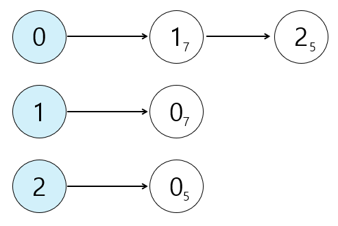

# DFS / BFS

> 그래프를 탐색하기 위한 대표적인 두 가지 알고리즘
>
> 탐색(Search): 많은 양의 데이터 중에서 원하는 데이터를 찾는 과정

## 꼭 필요한 자료구조 기초

> 자료 구조(Data Structure): 데이터를 표현하고 관리하고 처리하기 위한 구조

기본 자료구조인 스택과 큐는 다음으로 구성된다.

- 삽입(Push): 데이터를 삽입한다.

- 삭제(Pop): 데이터를 삭제한다.

- 오버플로(Overflow): 특정한 자료구조가 수용할 수 있는 데이터의 크기를 이미 가득 찬 상태에서 삽입 연산을 수행할 때 발생
- 언더플로(Underflow): 특정한 자료구조에 데이터가 전혀 들어있지 않은 상태에서 삭제 연산을 수행할 때 발생한다.

### 스택(Stack)

- 선입후출(First In Last Out) 구조 또는 후입선출(Last In First Out) 구조

- 파이썬에서 스택을 이용할 때는 기본 리스트의 `append()`와 `pop()` 메서드를 이용한다.

  - `append()`: 리스트의 가장 뒤쪽에 데이터를 삽입

  - `pop()`: 리스트의 가장 뒤쪽에서 데이터를 추출

### 큐(Queue)

- 선입선출(First In First Out) 구조

- 파이썬에서 큐를 구현할 때는 `collections` 모듈의 `deque` 자료구조를 활용할 수 있다.

  - `deque`는 데이터를 넣고 빼는 속도가 리스트 자료형에 비해 효율적이며, `queue` 라이브러리를 이용하는 것보다 간단하다.

  - `deque` 객체를 리스트 자료형으로 변경하려면 `list()` 메서드를 이용하면 된다.

### 재귀함수(Recursive Function)

> 자기 자신을 다시 호출하는 함수

- 컴퓨터 내부에서 재귀 함수의 수행은 스택 자료구조를 이용한다.

  함수를 계속 호출했을 때 가장 마지막에 호출한 함수가 먼저 수행을 끝내야 그 앞의 함수 호출이 종료되기 때문이다.

#### 재귀 함수의 종료 조건

- 재귀의 최대 깊이를 초과하면 오류 메시지를 출력하고 멈춘다. 따라서 무한한 재귀 호출을 진행할 수는 없다.

- 재귀함수를 문제에서 사용할 때는 재귀 함수가 끝나는 종료 조건을 꼭 명시해야 한다.

---

## 탐색 알고리즘 DFS / BFS

### 그래프(Graph)

> 그래프 탐색: 하나의 노드를 시작으로 다수의 노드를 방문하는 것

- 그래프는 노드(Node)와 간선(Edge)으로 표현되며, 이때 노드를 정점(Vertex)이라고도 한다.

  - 두 노드가 간선으로 연결되어 있다면 "두 노드는 인접하다"

- 프로그래밍에서 그래프는 크게 2가지 방식으로 표현할 수 있다.

1. 인접 행렬(Adjacency Matrix): 2차원 배열로 그래프의 연결 관계를 표현하는 방식

  

- 2차원 배열(Array)에 각 노드가 연결된 형태를 기록한다. 파이썬에서는 2차원 리스트로 구현할 수 있다.

- 연결되어 있지 않은 노드끼리는 무한의 비용이라고 작성한다.

<details>
  <summary>예제 코드</summary>

```python
# 무한의 비용 선언
INF = 999999999

# 2차원 리스트를 이용해 인접 행렬 표현
graph = [
    [0, 7, 5],
    [7, 0, INF],
    [5, INF, 0]
]

print(graph)
```

- 출력 코드
  `[[0, 7, 5], [7, 0, 999999999], [5, 999999999, 0]]`

</details>
  
2. 인접 리스트(Adjacency List): 리스트로 그래프의 연결 관계를 표현하는 방식

  

- 모든 노드에 연결된 노드에 대한 정보를 차례대로 연결하여 저장한다.

- "연결 리스트"라는 자료구조를 이용해 구현하는데, C++나 자바와 같은 언어에서는 별도의 표준 라이브러리를 제공한다.

- 파이썬은 기본 자료형인 리스트 자료형이 `append()`와 메소드를 제공하므로, 배열과 연결 리스트의 기능을 모두 기본으로 제공한다.

<details>
  <summary>예제 코드</summary>

```python
# 행(Row)이 3개인 2차원 리스트로 인접 리스트 표현
graph = [[] for _ in range(3)]

# 노드 0에 연결된 노드 정보 저장 (노드, 거리)
graph[0].append((1, 7))
graph[0].append((2, 5))

# 노드 1에 연결된 노드 정보 저장 (노드, 거리)
graph[1].append((0, 7))

# 노드 2에 연결된 노드 정보 저장 (노드, 거리)
graph[2].append((0, 5))

print(graph)
```

- 출력 코드
  `[[(1, 7), (2, 5)], [(0, 7)], [(0, 5)]]`

</details>

- 비교

  - 인접 행렬 방식은 모든 관계를 저장하므로 노드 개수가 많을수록 메모리가 낭비된다.

  - 인접 리스트 방식은 연결된 정보만을 저장하기 때문에 메모리를 효율적으로 사용하지만,
    특정한 두 노드가 연결되어 있는 지에 대한 정보를 얻는 속도가 느리다.

### DFS(Depth First Search, 깊이 우선 탐색)

> 그래프에서 깊은 부분을 우선적으로 탐색하는 알고리즘

DFS 동작 과정 (스택 자료구조)

1. 탐색 시작 노드를 스택에 삽입하고 방문 처리를 한다.

2-1. 스택의 최상단 노드에 방문하지 않은 인접 노드가 있으면, 그 인접 노드를 스택에 넣고 방문 처리를 한다.

> "방문 처리"는 스택에 한 번 삽입되어 처리된 노드가 다시 삽입되지 않게 체크하는 것

2-2. 방문하지 않은 인접 노드가 없으면 스택에서 최상단 노드를 꺼낸다.

3. `2`번의 과정을 더 이상 수행할 수 없을 때까지 반복한다.

- DFS의 기능을 생각하면 순서와 상관없이 처리해도 되지만, 문제에서 번호가 낮은 순서로 처리하도록 명시하는 경우가 있따.

  따라서 관행적으로 번호가 낮은 순서부터 처리하도록 구현한다.

- 데이터의 개수가 N개인 경우 O(N)의 시간이 소요된다.

<details>
<summary>DFS 재귀 함수 예제 코드</summary>

```python
# DFS 메서드 정의
def dfs(graph, v, visited):
    # 현재 노드를 방문 처리
    visited[v] = True
    print(v, end=" ")

    # 현재 노드와 연결된 다른 노드를 방문
    for i in graph[v]:
        if not visited[i]:
            dfs(graph, i, visited)

# 각 노드가 연결된 정보: 2차원 리스트
graph = [
    [],
    [2, 3, 8],
    [1, 7],
    [1, 4, 5],
    [3, 5],
    [3, 4],
    [7],
    [2, 6, 8],
    [1, 7]
]

# 각 노드의 방문 정보: 1차원 리스트
visited = [False] * 9

# DFS 함수 호출
dfs(graph, 1, visited)
```

- 출력

`1 2 7 6 8 3 4 5`

</details>

---

### BFS(Breadth First Search, 너비 우선 탐색)

> 가까운 노드부터 탐색하는 알고리즘

BFS 동작 과정 (큐 자료구조)

1. 탐색 시작 노드를 큐에 삽입하고 방문 처리를 한다.

2. 큐에서 노드를 꺼내 해당 노드의 인접 노드 중에서 방문하지 않은 노드를 모두 큐에 삽입하고 방문처리를 한다.

3. `2`번의 과정을 더 이상 수행할 수 없을 때까지 반복한다.

- 파이썬에서 `deque` 라이브러리를 사용하는 것이 좋으며, O(N)의 시간이 소요된다.

<details>
<summary>BFS deque 예제 코드</summary>

```python
from collections import deque

# BFS 메서드 정의
def bfs(graph, start, visited):
    # 큐(Queue) 구현을 위해 deque 라이브러리 사용
    queue = deque([start])
    # 현재 노드 방문 처리
    visited[start] = True

    # 큐가 빌 때까지 반복
    while queue:
        # 큐에서 하나의 원소를 뽑아 출력
        v = queue.popleft()
        print(v, end=" ")
        # 해당 원소와 연결된, 아직 방문하지 않은 원소를 큐에 삽입
        for i in graph[v]:
            if not visited[i]:
                queue.append(i)
                visited[i] = True

# 각 노드가 연결된 정보: 2차원 리스트
graph = [
    [],
    [2, 3, 8],
    [1, 7],
    [1, 4, 5],
    [3, 5],
    [3, 4],
    [7],
    [2, 6, 8],
    [1, 7]
]

# 각 노드의 방문 정보: 1차원 리스트
visited = [False] * 9

# BFS 함수 호출
bfs(graph, 1, visited)
```

- 출력

`1 2 3 8 7 4 5 6 `

</details>

---

### 실전 문제

|       문제       |           코드           |             정리             |
| :--------------: | :----------------------: | :--------------------------: |
| 음료수 얼려 먹기 | [풀이](./example/4-1.py) | [정리](./example/4-1_sol.md) |
|    미로 탈출     | [풀이](./example/4-2.py) | [정리](./example/4-2_sol.md) |
