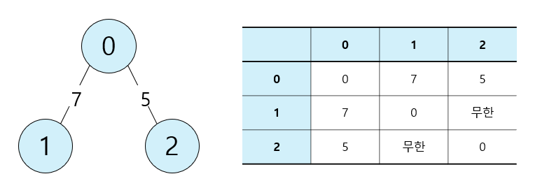

# DFS / BFS

> 그래프를 탐색하기 위한 대표적인 두 가지 알고리즘

## 꼭 필요한 자료구조 기초

탐색(Search): 많은 양의 데이터 중에서 원하는 데이터를 찾는 과정

자료 구조(Data Structure): 데이터를 표현하고 관리하고 처리하기 위한 구조

기본 자료구조인 스택과 큐는 두 핵심적인 함수로 구성된다.

- 삽입(Push): 데이터를 삽입한다.

- 삭제(Pop): 데이터를 삭제한다.

- 오버플로(Overflow): 특정한 자료구조가 수용할 수 있는 데이터의 크기를 이미 가득 찬 상태에서 삽입 연산을 수행할 때 발생

    즉, 저장 공간을 벗어나 데이터가 넘쳐 흐를 때 발생한다.
  
- 언더플로(Underflow): 특정한 자료구조에 데이터가 전혀 들어있지 않은 상태에서 삭제 연산을 수행할 때 발생한다.

### 스택(Stack)

- 선입후출(First In Last Out) 구조 또는 후입선출(Last In First Out) 구조

  입구와 출구가 동일한 형태로 스택을 시각화 할 수 있다.

- 파이썬에서 스택을 이용할 때는 기본 리스트의 `append()`와 `pop()` 메서드를 이용한다.

  - `append()`: 리스트의 가장 뒤쪽에 데이터를 삽입
  
  - `pop()`: 리스트의 가장 뒤쪽에서 데이터를 추출
  
### 큐(Queue)

- 선입선출(First In First Out) 구조

- 파이썬에서 큐를 구현할 때는 `collections` 모듈의 `deque` 자료구조를 활용할 수 있다.

  `deque`는 데이터를 넣고 빼는가 리스트 자료형에 비해 효율적이며, `queue` 라이브러리를 이용하는 것보다 간단하다.
  
  - 또한 `deque` 객체를 리스트 자료형으로 변경하려면 `list()` 메서드를 이용하면 된다.
  
### 재귀함수(Recursive Function)

> 자기 자신을 다시 호출하는 함수

- 컴퓨터 내부에서 재귀 함수의 수행은 스택 자료구조를 이용한다.

  함수를 계속 호출했을 때 가장 마지막에 호출한 함수가 먼저 수행을 끝내야 그 앞의 함수 호출이 종료되기 때문이다.

#### 재귀 함수의 종료 조건

- 재귀의 최대 깊이를 초과하면 오류 메시지를 출력하고 멈춘다. 따라서 무한한 재귀 호출을 진행할 수는 없다.

- 재귀함수를 문제에서 사용할 때는 재귀 함수가 언제 끝날 지 종료 조건을 꼭 명시해야 한다.

---

## 탐색 알고리즘 DFS / BFS

### DFS(Depth-First Search, 깊이 우선 탐색)

> 그래프에서 깊은 부분을 우선적으로 탐색하는 알고리즘

##### 그래프(Graph)의 기본 구조

- 그래프 탐색: 하나의 노드를 시작으로 다수의 노드를 방문하는 것

- 그래프는 노드(Node)와 간선(Edge)으로 표현되며, 이때 노드를 정점(Vertex)이라고도 한다.

  두 노드가 간선으로 연결되어 있다면 "두 노드는 인접하다"라고 표현한다.

- 프로그래밍에서 그래프는 크게 2가지 방식으로 표현할 수 있다.

1. 인접 행렬(Adjacency Matrix): 2차원 배열로 그래프의 연결 관계를 표현하는 방식

  2차원 배열(Array)에 각 노드가 연결된 형태를 기록하는 방식이다. 파이썬에서는 2차원 리스트로 구현할 수 있다. 

  연결되어 있지 않은 노드끼리는 무한의 비용이라고 작성한다.


{: width="100" height="100"}

<details>
  <summary>예제 코드</summary>

  ```python
  # 무한의 비용 선언
  INF = 999999999

  # 2차원 리스트를 이용해 인접 행렬 표현
  graph = [
      [0, 7, 5],
      [7, 0, INF],
      [5, INF, 0]
  ] 

  print(graph)
  ```

  - 출력 코드
  `[[0, 7, 5], [7, 0, 999999999], [5, 999999999, 0]]`
    
</details>
  
2. 인접 리스트(Adjacency List): 리스트로 그래프의 연결 관계를 표현하는 방식

  모든 노드에 연결된 노드에 대한 정보를 차례대로 연결하여 저장한다.

