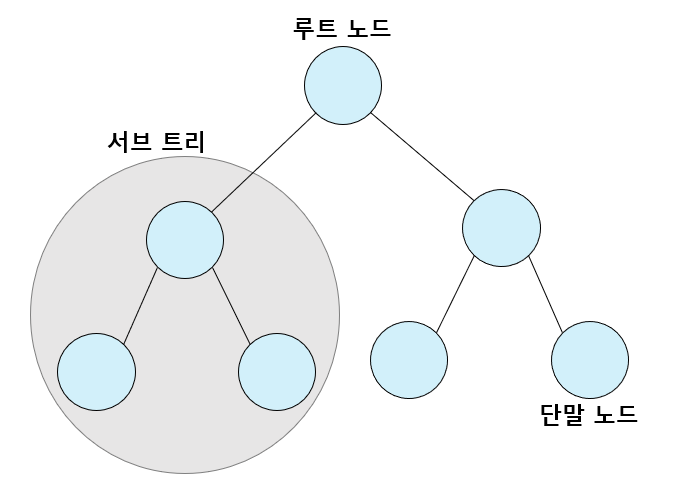
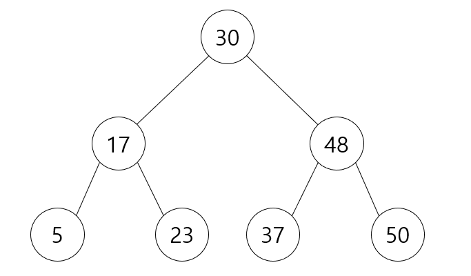

# 이진탐색

> 탐색 범위를 반으로 좁혀가며 빠르게 탐색하는 알고리즘

---

## 순차 탐색(Sequential Search)

> 가장 기본 탐색 방법
>
> 리스트 안에 있는 특정한 데이터를 찾기 위해 앞에서부터 데이터를 하나씩 차례대로 확인하는 방법

보통 정렬되지 않은 리스트에서 데이터를 찾을 때 사용한다.

리스트에 데이터가 아무리 많아도 시간만 충분하다면 항상 원하는 원소(데이터)를 찾을 수 있다.

1. 첫 번째 데이터를 확인한다.

2. 찾고자 하는 문자열과 같지 않다면 다음 데이터로 이동하고. 찾고자 하는 문자열과 같다면 탐색을 종료한다.

[순차탐색 소스코드](./example/ex6_sequential.py)

- 데이터의 개수가 N개일 때 최대 N번의 비교 연산이 필요하므로 최악의 경우 시간복잡도는 `O(N)`이다.

---

## 이진 탐색(Binary Search)

> 배열 내부의 데이터가 정렬되어 있어야만 사용할 수 있다.
>
> 탐색 범위를 절반씩 좁혀가며 데이터를 탐색

탐색하고자 하는 범위의 시작점, 끝점, 중간점 위치을 나타내는 변수 3개를 사용한다.

찾으려는 데이터와 중간점 위치에 있는 데이터를 반복적으로 비교해서 원하는 데이터를 찾는다.

1. 시작점과 끝점을 확인한 다음 둘 사이의 중간점을 정한다. (중간점이 실수일 때는 소수점 이하를 버린다.)

2. 중간점의 데이터와 찾으려는 데이터를 비교한다.

- 중간점에 위치한 데이터가 찾으려는 데이터보다 크다면, 끝점을 중간점으로 변경한다.

- 중간점에 위치한 데이터가 찾으려는 데이터보다 작다면, 시작점을 중간점으로 변경한다.

3. 1~2의 과정을 반복하다가 중간점에 위치한 데이터가 찾으려는 데이터와 동일하면 탐색을 종료한다.

- 이진 탐색은 한 번 확인할 때마다 원소의 개수가 절반씩 줄어든다는 점에서 시간 복잡도가 `O(logN)`이다.

[재귀 함수로 구현한 이진탐색 소스코드](./example/ex6_binary_recursion.py)

[반복문으로 구현한 이진탐색 소스코드](./example/ex6_binary_iteration.py)

### 코딩테스트에서의 이진 탐색

참고할 소스코드가 없는 상태에서 이진탐색을 구현하는 것은 어려운 작업이 될 수 있으니 코드를 작성해보며 외우는 것이 좋다.

이진탐색의 원리는 다른 알고리즘에서도 폭넓게 적용되는 원리와 유사하다. 또한 높은 난이도의 문제에서 다른 알고리즘과 함께 사용되기도 한다.

코딩 테스트에서 이진 탐색은 탐색 범위가 큰 상황에서 접근하는 것이 좋다. 탐색 범위가 2000만을 넘어가면 이진탐색으로 문제에 접근하도록 하자.

---

## 트리 자료구조

데이터베이스는 내부적으로 대용량 데이터 처리에 적합한 트리(Tree) 자료구조를 이용하여 항상 데이터가 정렬되어 있다. 따라서 데이터베이스에서의 탐색은 이진탐색과 유사한 방법을 이용해 탐색을 항상 빠르게 수행하도록 설계되어 있다.

트리 자료구조는 노드와 노드의 연결로 표현하며 노드는 정보의 단위로서 어떠한 정보를 가지고 있는 개체이다.

트리 자료구조는 그래프 자료구조의 일종으로 데이터베이스 시스템이나 파일 시스템과 같은 곳에서 많은 엥의 데이터를 관리하기 위한 목적으로 사용된다.



- 트리는 부모 노드와 자식 노드의 관계로 표현된다.

- 트리의 최상단 노드를 루트 노드라고 한다.

- 트리의 최하단 노드를 단말 노드라고 한다.

- 트리에서 일부를 떼어내도 트리 구조이며 이를 서브트리라 한다.

- 트리는 파일 시스템과 같이 계층적이고 정렬된 데이터를 다루기에 적합하다.

## 이진 탐색 트리

트리 자료구조 중에서 가장 간단한 형태가 이진 탐색 트리이다.

이진 탐색이 동작할 수 있도록 고안된, 효율적인 탐색이 가능한 자료구조이다.

> 이진 탐색 트리 예시



- 부모 노드보다 왼쪽 자식 노드가 작다.

- 부모 노드보다 오른쪽 자식 노드가 크다.

- 즉 `왼쪽 자식 노드 < 부모 노드 < 오른쪽 자식 노드`가 성립해야 이진 탐색 트리라 할 수 있다.

이진 탐색 트리에 데이터를 넣고 빼는 방법은 알고리즘보다는 자료구조에 가까우며, 이진 탐색 트리 자료구조를 구현하도록 요구하는 문제는 출제 빈도가 낮다.

따라서 이진 탐색 트리가 구현되어 있다고 가정하고 데이터를 조회하는 과정만 살펴보자.

1. 이진 탐색은 루트 노드부터 방문한다.

2. 부모 노드와 찾는 원소값을 비교한다.

- 부모 노드가 찾는 값보다 크면, 왼쪽 자식 노드를 방문한다.

- 부모 노드가 찾는 값보다 작으면, 오른쪽 자식 노드를 방문한다.

3. 방문한 노드의 값이 찾는 값과 동일하면 탐색을 종료한다.

---

### 빠르게 입력받기

이진 탐색 문제는 입력 데이터가 많거나 탐색 범위가 매우 넓은 편이다.

입력 데이터가 많을 때는 `sys` 라이브러리의 `readline()` 함수를 이용해 시간 초과를 피할 수 있다.

sys 라이브러리를 사용하면 줄바꿈 기호가 입력되므로 공백 문자를 제거하는 함수를 사용해야 한다.

```python
import sys
# 하나의 문자열 데이터 입력받기
input_data = sys.stdin.readline().rsrtip()
```

---

---

### 실전 문제

|       문제       |           코드           |             정리             |
| :--------------: | :----------------------: | :--------------------------: |
|    부품 찾기     | [풀이](./example/6-1.py) | [정리](./example/6-1_sol.md) |
| 떡볶이 떡 만들기 | [풀이](./example/6-2.py) | [정리](./example/6-2_sol.md) |
