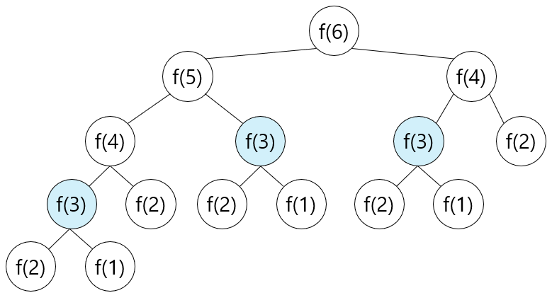

# 다이나믹 프로그래밍(Dynamic Programing), 동적 계획법

> 한 번 계산한 문제는 다시 계산하지 않도록 하는 알고리즘

> 다이나믹 프로그래밍과 동적 할당의 다이나믹
>
> 프로그램에서 다이나믹은 "프로그램이 실행되는 도중에"라는 의미이다.
>
> 예를 들어 자료구조에서 동적 할당(Dynamic Allocation)은 프로그램 실행 중에 프로그램 실행에 필요한 메모리를 할당하는 기법이다.
>
> 그러나, 다이나믹 프로그래밍에서의 '다이나믹'은 다른 의미이다.

### 피보나치 수열

피보나치 수열은 이전 두 항의 합을 현재의 항으로 설정하는 특징이 있는 수열이다. 수학에서는 점화식을 사용해 수열의 항이 이어지는 형태를 간결하게 표현한다.

> 점화식(또는 재귀식: Recurrence relation): 인접한 항들 사이의 관계식

- 피보나치 수열의 점화식: `𝑎_(𝑛+2)=𝑎_(𝑛+1)+𝑎_𝑛`

  - n번째 피보나치 수 = (n - 1)번째 피보나치 수 + (n - 2)번째 피보나치 수

  - 단, 1번째 피보나치 수 = 1, 2번째 피보나치 수 = 1

프로그래밍에서는 이러한 수열을 배열이나 리스트로 표현할 수 있다. 파이썬에서는 리스트 자료형이 이를 처리하고, C/C++와 자바에서는 배열을 이용해 이를 처리한다.

수학적 점화식을 프로그래밍으로 표현하려면 재귀함수를 사용한다.

<details>
  <summary>피보나치 함수 소스코드</summary>
  
  ```python
  # 피보나치 함수(Fibonacci Function)를 재귀 함수로 구현
  def fibo(x):
      if x == 1 or x == 2:
        return 1
      return fibo(x-1) + fibo(x-2)
  ```
</details>

그러나 이 코드는 빅오 표기법으로 표현하면 `O(2ⁿ)`의 지수 시간이 소요된다. n이 커질수록 수행 시간이 기하급수적으로 늘어난다.

> f(6)일때의 호출 과정



동일한 함수가 반복적으로 호출되는 것을 알 수 있다. 이미 한 번 계산했지만, 호출할 때마다 계속 계산하는 것이다.

즉, f(n)에서 n이 커질수록 반복해서 호출하는 수가 많아진다.

이처럼 피보나치 수열의 점화식을 재귀 함수를 사용해 만들면, 문제를 효율적으로 해결할 수 없다.

이러한 문제는 다이나믹 프로그래밍을 사용해 효율적으로 해결할 수 있다.

단, 항상 다이나믹 프로그래밍을 사용할 수 없으며 다음 조건을 만족할 때만 사용할 수 있다.

1. 큰 문제를 작은 문제로 나눌 수 있다.

2. 작은 문제에서 구한 정답은 그것을 포함하는 큰 문제에서도 동일하다.

---

## 메모이제이션(Memoization)

> 다이나믹 프로그래밍을 구현하는 방법 중 한 종류
>
> 한 번 구한 결과를 메모리 공간에 메모해두고 같은 식을 다시 호출하면 메모한 결과를 그대로 가져오는 기법
>
> 메모이제이션은 값을 저장하는 방법이므로 캐싱(Caching) 이라고도 한다.

1. 한 번 구한 정보를 리스트에 저장한다.

2. 다이나믹 프로그래밍을 재귀적으로 수행하다가 같은 정보가 필요할 때는 구한 정보를 리스트에서 가져온다.

[메모이제이션 피보나치 수열 소스코드](./example/ex7_memoization.py)

다시말해 다이나믹 프로그래밍이란 큰 문제를 작게 나누고, 같은 문제라면 한 번씩만 풀어 문제를 효율적으로 해결하는 알고리즘 기법이다.

다이나믹 프로그래밍은 분할 정복과는 달리 문제들이 서로 영향을 미치고 있다.

> 분할 정복(Divide and Conquer) 알고리즘의 예시로는 퀵 정렬이 있다.
>
> 퀵 정렬에서는 정렬할 리스트를 분할하며 전체적으로 정렬이 될 수 있도록 한다.

재귀 함수를 사용하면 함수를 다시 호출했을 때 메모리 상에 적재되는 과정을 따라야 하므로 오버헤드가 발생할 수 있다. 따라서 재귀 함수 대신 반복문을 사용해 오버헤드를 줄일 수 있다. 일반적으로 반복문을 이용한 다이나믹 프로그래밍이 더 성능이 좋다.

다이나믹 프로그래밍을 적용했을 때 피보나치 수열 알고리즘의 시간 복잡도는 `O(N)`이다.

재귀 함수를 이용해 다이나믹 프로그래밍 소스코드를 작성하는 방법은 큰 문제를 해결하기 위해 작은 문제를 호출한다고 하여 **탑다운(Top-Down) 방식**이라고 한다.

반대로 단순히 반복문을 이용한 경우 작은 문제부터 차근차근 답을 도출한다고 하여 **바텀업(Bottom-Up) 방식**이라 한다.

## [바텀업-반복문 피보나치 수열 소스코드](./example/ex7_bottom-up-fibo.py)

---

탑다운(메모이제이션) 방식은 '하향식', 바텀업 방식은 '상향식'이라고도 한다.

전형적인 형태는 바텀업 방식이고, 바텀업 방식에서 사용되는 결과 저장 리스트를 'DP 테이블'이라고 부른다. '메모이제이션'은 탑다운 방식에 국한되어 사용되는 표현이다.

메모이제이션은 때에 따라 배열이나 리스트가 아닌 다른 자료형을 이용할 수도 있다. 수열처럼 연속적이지 않은 경우에는 사전(dict) 자료형을 사용하는게 더 효과적이다.

특정한 문제를 완전 탐색 알고리즘으로 접근했을 때 시간이 매우 오래 걸린다면 다이나믹 프로그래밍을 적용할 수 있는 지 확인해야 한다.

단순히 재귀 함수로 작성 후 메모이제이션으로 코드를 개선하는 방법도 좋은 아이디어다.

또한 재귀 함수의 스택 크기가 한정되어 있을 수 있기 때문에 탑다운 방식보다는 바텀업 방식으로 구현하는 것이 좋다.

재귀 함수를 사용하면 재귀 함수 깊이(recursion depth)와 관련된 오류가 발생할 수 있다. 이 경우에는 `sys` 라이브러리의 `setrecursionlimit()` 함수를 호출하여 재귀 제한을 완화시킬 수 있다.

---

### 실전 문제

|        문제        |           코드           |             정리             |
| :----------------: | :----------------------: | :--------------------------: |
|     1로 만들기     | [풀이](./example/7-1.py) | [정리](./example/7-1_sol.md) |
|     개미 전사      | [풀이](./example/7-2.py) | [정리](./example/7-2_sol.md) |
|     바닥 공사      | [풀이](./example/7-3.py) | [정리](./example/7-3_sol.md) |
| 효율적인 화폐 구성 | [풀이](./example/7-4.py) | [정리](./example/7-4_sol.md) |

---
