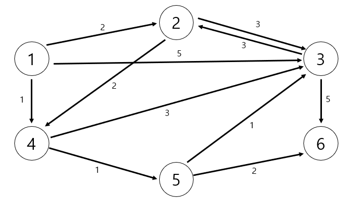
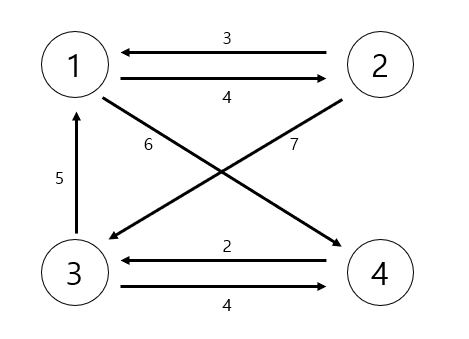

# 최단 경로

> 특정 지점까지 가장 빠르게 도달하는 방법을 찾는 알고리즘

## 가장 빠른 길 찾기

최단 경로(Shortest Path) 알고리즘은 말 그대로 가장 짧은 경로를 찾는 알고리즘이다. "길 찾기" 문제라고도 불린다.

보통 그래프를 이용해 표현하는데, 각 지점은 "노드"로 표현되고, 지점 간 연결된 도로는 "간선"으로 표현된다.

자주 사용하는 최단 거리 알고리즘은 다익스트라, 플로이드 워셜, 벨만포드 3가지이다. 예제에서는 코딩 테스트에서 많이 등장하는 다익스트라와 플로이드 워셜 알고리즘 유형만 다룬다.

---

## 다익스트라(Dijkstra, 테이크스트라) 최단 경로 알고리즘

> 그래프에서 여러 개의 노드가 있을 때, 특정한 노드에서 출발하여 다른 노드로 가는 각각의 최단 경로를 구해주는 알고리즘

"음의 간선"이 없을 때 정상적으로 동작한다. 현실의 길은 음의 간선으로 표현되지 않으므로 다익스트라 알고리즘은 실제로 GPS 소프트웨어의 기본 알고리즘으로 채택되곤 한다.

> 음의 간선: 0보다 작은 값을 가지는 간선

다익스트라 알고리즘은 매번 "가장 비용이 적은 노드"를 선택해서 임의의 과정을 반복하기 때문에 그리디 알고리즘으로 분류된다.

1. 출발 노드를 설정한다.

2. 최단 거리 테이블을 초기화한다.

3. 방문하지 않은 노드 중에서 최단 거리가 가장 짧은 노드를 선택한다.

4. 해당 노드를 거쳐 다른 노드로 가는 비용을 계산하여 최단 거리 테이블을 갱신한다.

5. 3번과 4번을 반복한다.

- 최단 경로를 구하는 과정에서 "각 노드에 대한 현재 까지의 최단 거리" 정보를 항상 1차원 리스트에 저장하며 리스트를 계속 갱신한다.

> 다익스트라 알고리즘을 구현하는 방법은 2가지이다.
>
> 방법 1. 구현하기 쉽지만 느리게 동작하는 코드
>
> 방법 2. 구현하기에 조금 더 까다롭지만 빠르게 동작하는 코드

---

<details>
  <summary>다익스트라 알고리즘의 동작 원리</summary>
    
  

출발 노드를 1번 노드로 설정하고 다른 모든 노드로 가는 최단 거리를 '무한'으로 초기화

| 노드 번호 |  1  |  2   |  3   |  4   |  5   |  6   |
| :-------: | :-: | :--: | :--: | :--: | :--: | :--: |
|   거리    |  0  | 무한 | 무한 | 무한 | 무한 | 무한 |

1. 방문하지 않은 노드 중에서 최단 거리가 가장 짧은 노드를 선택한다. 출발 노드에서 출발 노드로의 거리는 0으로 보기 때문에 처음에는 출발 노드가 선택된다.

2. 1번 노드를 거쳐 다른 노드로 가는 비용을 계산한다.

- 1번 노드를 거쳐서 2번, 3번, 4번 노드로 가는 최소 비용은 각각 `2(=0+2)`, `5(=0+5)`, `1(=0+1)`이다.

- 현재 설정된 거리보다 더 짧은 경로를 찾았다면 새로운 값으로 갱신한다.

| 노드 번호 | _1_ |  2  |  3  |  4  |  5   |  6   |
| :-------: | :-: | :-: | :-: | :-: | :--: | :--: |
|   거리    |  0  |  2  |  5  |  1  | 무한 | 무한 |

3. 이후 방문하지 않은 노드 중에서 최단 거리가 가장 짧은 노드를 선택한다.

- 4번 노드가 선택되고, 4번 노드를 거쳐서 갈 수 있는 노드를 확인한다.

  4번 노드를 거쳐 3번과 5번 노드로 가는 최소 비용은 `4(=1+3)`, `2(1+1)`이다.

  기존 리스트에 담겨 있던 값보다 작다면, 리스트를 갱신한다.

| 노드 번호 | _1_ |  2  |  3  | _4_ |  5  |  6   |
| :-------: | :-: | :-: | :-: | :-: | :-: | :--: |
|   거리    |  0  |  2  |  4  |  1  |  2  | 무한 |

4. 방문하지 않은 노드의 최단 거리가 같은 경우 일반적으로 번호가 작은 노드를 선택한다.

- 2번 노드를 선택해 이 노드를 거쳐서 3번 노드로 이동하는 비용은 `5(=2+3)`이다. 기존 리스트의 값보다 크므로 값을 갱신하지 않는다.

| 노드 번호 | _1_ | _2_ |  3  | _4_ |  5  |  6   |
| :-------: | :-: | :-: | :-: | :-: | :-: | :--: |
|   거리    |  0  |  2  |  4  |  1  |  2  | 무한 |

5. 5번 노드를 선택, 동일한 과정을 반복한다.

| 노드 번호 | _1_ | _2_ |  3  | _4_ | _5_ |  6  |
| :-------: | :-: | :-: | :-: | :-: | :-: | :-: |
|   거리    |  0  |  2  |  3  |  1  |  2  |  4  |

6. 3번 노드를 선택, 동일한 과정을 반복한다.

| 노드 번호 | _1_ | _2_ | _3_ | _4_ | _5_ |  6  |
| :-------: | :-: | :-: | :-: | :-: | :-: | :-: |
|   거리    |  0  |  2  |  3  |  1  |  2  |  4  |

7. 6번 노드를 선택, 동일한 과정을 반복한다.

최종 최단거리 테이블은 다음과 같다.

| 노드 번호 | _1_ | _2_ | _3_ | _4_ | _5_ | _6_ |
| :-------: | :-: | :-: | :-: | :-: | :-: | :-: |
|   거리    |  0  |  2  |  3  |  1  |  2  |  4  |

다익스트라 알고리즘에서 "방문하지 않은 노드 중 최단거리가 가장 짧은 노드를 선택" 하는 과정을 반복하는데, 이렇게 선택된 노드는 "최단 거리가 완전히 선택된 노드"로 더 이상 알고리즘을 반복해도 최단 거리가 줄어들지 않는다.

따라서 다익스트라 알고리즘이 진행되면서 한 단계당 하나의 노드에 대한 최단 거리를 확실히 찾는 것을 알 수 있다.

</details>

---

### 방법 1. 간단한 다익스트라 알고리즘

간단한 다익스트라 알고리즘은 `O(V²)`의 시간 복잡도를 가지며, 다익스트라에 의해서 처음 고안된 알고리즘이다. 여기서 V는 노드의 개수를 의미한다.

1. 처음 각 노드에 대한 최단 거리를 담는 1차원 리스트를 선언한다.

2. 단계마다 "방문하지 않은 노드 중에서 최단 거리가 가장 짧은 노드를 선택"하기 위해 매 단계마다 1차원 리스트의 모든 원소를 확인(순차 탐색)한다.

> 그래프를 표현할 때 일반적으로 리스트는 `노드의 개수 + 1`의 크기로 할당하여 노드의 번호를 인덱스로 리스트에 접근할 수 있도록 한다.

[간단한 다익스트라 알고리즘 소스코드](./example/ex8_dijkstra1.py)

#### 간단한 다익스트라 알고리즘의 시간 복잡도

시간복잡도는 `O(V²)`이다. 총 `O(V)`번에 걸쳐 최단 거리가 가장 짧은 노드를 매번 선형 탐색 해야하고, 현재 노드와 연결된 노드를 매번 일일이 확인하기 때문이다.

따라서 전체 노드의 개수가 5,000개 이하라면 이 코드를 사용할 수 있을 것이다. 하지만 노드의 개수가 10,000개를 넘어가는 문제는 해결하기 어렵다.

---

### 방법 2. 개선된 다익스트라 알고리즘

이 방법으로 구현된 다익스트라 알고리즘은 최악의 경우에도 시간 복잡도 `O(ElogV)`를 보장한다. 여기서 V는 노드의 개수이고, E는 간선의 개수를 의미한다.

개선된 다익스트라 알고리즘은 힙(Heap) 자료구조를 사용한다. 힙 자료구조를 이용하면 특정 노드까지의 최단 거리에 대한 정보를 힙에 담아서 처리하므로 거리가 짧은 노드를 더 빠르게 찾을 수 있다.

---

#### 힙(Heap)

> 힙 자료구조는 우선순위 큐(Priority Queue)를 구현하기 위해 사용하는 자료구조 중 하나이다.
>
> 우선순위 큐: 우선순위가 가장 높은 데이터를 가장 먼저 삭제한다.

우선순위 큐는 데이터를 우선순위에 따라 처리하고 싶을 때 사용한다. 대부분의 프로그래밍 언어에서는 우선순위 큐 라이브러리를 지원하기 때문에 따로 구현할 일은 없다.

파이썬에서는 `PriorityQueue` 또는 `heapq` 라이브러리를 사용할 수 있다. 일반적으로 더 빠르게 동작하는 `heapq`를 주로 사용한다.

우선순위 값을 표현할 때는 정수형의 변수가 사용된다. 우선순위 큐 라이브러리에 데이터의 묶음을 넣으면, 첫 번째 원소를 기준으로 우선순위를 설정한다.

또한 우선순위 큐를 구현할 때는 내부적으로 최소 힙(min heap) 또는 최대 힙(max heap)을 이용한다. 최소 힙을 이용하는 경우 '값이 낮은 데이터가 먼저 삭제'되고, 최대 힙을 이용하는 경우 '값이 큰 데이터가 먼저 삭제'된다.

파이썬에서는 기본적으로 최소 힙 구조를 이용하며, 다익스트라 최단 경로 알고리즘에서는 비용이 적은 노드를 우선하여 방문하므로 최소 힙 구조를 기반으로 하는 라이브러리를 그대로 사용할 수 있다.

최소 힙을 최대 힙처럼 사용하기 위해서 우선순위에 해당하는 값에 음수 부호(`-`)를 붙여 넣었다가, 마지막에 원래의 값으로 돌리는 방식을 이용할 수 있다.

우선순위 큐를 구현하는 방법은 리스트와 힙이 있다.

| 우선순위 큐 구현 방식 | 삽입 시간 | 삭제 시간 |
| --------------------- | --------- | --------- |
| 리스트                | O(1)      | O(N)      |
| 힙(Heap)              | O(logN)   | O(logN)   |

<details>
  <summary>우선순위 큐 동작 방식</summary>
  
우선순위 큐를 적용하여도 다익스트라 알고리즘이 동작하는 기본 원리는 동일하다. 최단 거리를 저장하기 위한 1차원 리스트는 그대로 이용하고, 현재 가장 가까운 노드를 저장하기 위한 목적으로만 우선순위 큐를 추가로 이용한다.


1. 1번 노드가 출발 노드일 때, 출발 노드를 제외한 모든 노드의 최단 거리를 무한으로 설정한다.

- 우선순위 큐에 1번 노드를 넣는다.

  1번 노드로 가는 거리는 자기 자신까지 도달하는 거리이기 때문에 0이다. 즉, `(거리: 0, 노드: 1)`의 정보를 가지는 객체를 우선순위 큐에 넣는다.

| 노드 번호 |  1  |  2   |  3   |  4   |  5   |  6   |
| :-------: | :-: | :--: | :--: | :--: | :--: | :--: |
|   거리    |  0  | 무한 | 무한 | 무한 | 무한 | 무한 |

| 우선순위 큐 | (0, 1) |
| ----------- | ------ |

2. 거리가 가장 짧은 노드를 선택하기 위해서는 우선순위 큐에서 노드를 꺼낸다. 기본적으로 거리가 짧은 원소가 우선순위 큐의 최상위 원소로 위치해 있다.

- 해당 노드를 이미 처리한 적이 있다면 무시한다.

- `(0, 1)`은 1번 노드까지 가는 최단 거리가 0이라는 의미이므로, 1번 노드를 거쳐 2번, 3번, 4번 노드로 가는 최소 비용을 계산한다. 차례로 2, 5, 1이고, 현재 테이블의 값보다 더 짧은 경로이므로 각각 갱신한다.

- 더 짧은 경로를 찾은 노드 정보들은 다시 우선순위 큐에 넣는다.

| 노드 번호 | _1_ |  2  |  3  |  4  |  5   |  6   |
| :-------: | :-: | :-: | :-: | :-: | :--: | :--: |
|   거리    |  0  |  2  |  5  |  1  | 무한 | 무한 |

| 우선순위 큐 | (1, 4), (2, 2), (5, 3) |
| ----------- | ---------------------- |

3. 우선순위 큐에서 원소를 꺼내 동일한 과정을 반복한다.

- `(1, 4)`가 추출되고, 아직 4번 노드를 방문하지 않았으며, 최단 거리가 가장 짧은 노드이다. 따라서 4번 노드를 기준으로 연결된 간선을 확인 후 리스트를 갱신한다. 갱신된 노드의 정보는 우선순위 큐에 넣는다.

| 노드 번호 | _1_ |  2  |  3  | _4_ |  5  |  6   |
| :-------: | :-: | :-: | :-: | :-: | :-: | :--: |
|   거리    |  0  |  2  |  4  |  1  |  2  | 무한 |

| 우선순위 큐 | (2, 2), (2, 5), (4, 3), (5, 3) |
| ----------- | ------------------------------ |

4. 마찬가지로 `(2, 2)`가 추출되고 노드 2에 대해 처리한다. 2번 노드를 거쳐 가는 경우 중 최단 거리를 더 짧게 갱신할 수 있는 방법은 없으므로 우선순위 큐에 어떠한 원소도 들어가지 않는다.

| 노드 번호 | _1_ | _2_ |  3  | _4_ |  5  |  6   |
| :-------: | :-: | :-: | :-: | :-: | :-: | :--: |
|   거리    |  0  |  2  |  4  |  1  |  2  | 무한 |

| 우선순위 큐 | (2, 5), (4, 3), (5, 3) |
| ----------- | ---------------------- |

5. `(2, 5)`가 추출되고 노드 5에 대해 처리한다.

| 노드 번호 | _1_ | _2_ |  3  | _4_ | _5_ |  6  |
| :-------: | :-: | :-: | :-: | :-: | :-: | :-: |
|   거리    |  0  |  2  |  3  |  1  |  2  |  4  |

| 우선순위 큐 | (3, 3), (4, 3), (4, 6), (5, 3) |
| ----------- | ------------------------------ |

6. `(3, 3)`이 추출되고 노드 3애 대해 처리한다.

| 노드 번호 | _1_ | _2_ | _3_ | _4_ | _5_ |  6  |
| :-------: | :-: | :-: | :-: | :-: | :-: | :-: |
|   거리    |  0  |  2  |  3  |  1  |  2  |  4  |

| 우선순위 큐 | (4, 3), (4, 6), (5, 3) |
| ----------- | ---------------------- |

7. `(4, 3)`이 추출되고 노드 3에 대해 처리한다. 3번 노드는 앞서 처리된 적 있기 때문에 해당 원소는 무시되고 다음 원소를 추출한다.

8. `(4, 6)`이 추출되고 노드 6에 대해 처리한다.

| 노드 번호 | _1_ | _2_ | _3_ | _4_ | _5_ | _6_ |
| :-------: | :-: | :-: | :-: | :-: | :-: | :-: |
|   거리    |  0  |  2  |  3  |  1  |  2  |  4  |

| 우선순위 큐 | (5, 3) |
| ----------- | ------ |

9. 마지막으로 남은 원소 `(5, 3)`에 대해 처리한다. 이미 처리된 노드이므로 무시한다.

| 노드 번호 | _1_ | _2_ | _3_ | _4_ | _5_ | _6_ |
| :-------: | :-: | :-: | :-: | :-: | :-: | :-: |
|   거리    |  0  |  2  |  3  |  1  |  2  |  4  |

| 우선순위 큐 |     |
| ----------- | --- |

- 모든 단계를 거친 후에 최단 거리 테이블에 남아있는 데이터가 각 노드로의 최단 거리이다.

</details>

---

[개선된 다익스트라 알고리즘 소스코드](./example/ex8_dijkstra2.py)

- "최단 거리가 가장 짧은 노드"를 선택하는 과정을 다익스트라 함수 안에서 우선순위 큐를 이용하는 방식으로 대체할 수 있기 때문에 앞선 코드의 `get_smallest_node()` 함수를 작성할 필요가 없다.

#### 개선된 다익스트라 알고리즘의 시간 복잡도

시간 복잡도는 `O(ElogV)`로 훨씬 빠르다.

우선순위 큐로 구현한 다익스트라 알고리즘에서 한 번 처리된 노드는 더 이상 처리되지 않는다. 다시 말해 큐에 노드를 하나씩 꺼내 검사하는 반복문은 노드의 개수 `V` 이상의 횟수로는 반복되지 않는다. 또한 V번 반복될 때마다 각각 자신과 연결된 간선들을 모두 확인한다. 따라서 "현재 우선순위 큐에서 꺼낸 노드와 연결된 다른 노드들을 확인"하는 총 횟수는 최대 간선의 개수 `E` 만큼 연산이 수행된다.

따라서 전체 다익스트라 알고리즘은 E개의 원소를 우선순위 큐에 넣었다가 모두 빼내는 연산과 유사하다. 힙에 N개의 데이터를 모두 넣고, 모두 빼는 과정은 `O(NlogN)`으로, 최대 E개의 간선 데이터를 힙에 넣었다가 빼는 과정은 `O(ElogE)`이다.

이 때, 중복 간선을 포함하지 않는 경우, E는 항상 V²보다 작다. 모든 노드끼리 서로 연결되어 있을 때 간선의 개수는 약 V²이기 때문이다. 다시 말해 `logE ≤ logV²`이고, `O(logV²) = O(2logV) = O(logV)`이다. 따라서 다익스트라 알고리즘의 전체 시간 복잡도는 `O(ElogV)`라 표현할 수 있다.

---

## 플로이드 워셜(Floyd-Warshall) 알고리즘

> 모든 지점에서 다른 모든 지점까지의 최단 경로를 모두 구해야 하는 경우 사용할 수 있는 알고리즘

노드의 개수가 N개 일때 알고리즘 상으로 N번의 단계를 수행하며, 단계마다 `O(N²)`의 연산을 통해 "현재 노드를 거쳐 가는 모든 경로"를 고려한다. 따라서 플로이드 워셜 알고리즘의 시간 복잡도는 `O(N³)`이다.

플로이드 워셜 알고리즘은 모든 노드에 대하여 다른 모든 노드로 가는 최단거리 정보를 담아야 하기 때문에 2차원 리스트에 최단 거리 정보를 저장한다.

또한 노드의 개수가 N개일 때, N번 만큼의 단계를 반복하며 점화식에 맞게 2차원 리스트를 갱신하기 때문에 다이나믹 프로그래밍으로 볼 수 있다.

각 단계에서는 해당 노드를 거쳐 가는 경우를 고려한다. 따라서 현재 확인하고 있는 노드를 제외하고, `N - 1`개의 노드 중에서 서로 다른 노드 `(A, B)`쌍을 선택한다. 이후에 `A번 노드 → 현재 노드 → B번 노드`의 비용을 확인한 뒤 최단 거리를 갱신한다. 다시 말해 `(n-1)P₂`개의 쌍을 단계마다 반복해서 확인하면 된다.

K번의 단계에 대한 점화식은 `D_ab = min(D_ab + D_ak + D_kb)`로 표현할 수 있다. "A에서 B로 가는 최소 비용"과 "A에서 K를 거쳐 B로 가는 비용"을 비교하여 더 작은 값으로 갱신하는 것이다.

<details>
  <summary>플로이드 워셜 알고리즘 예시</summary>



다음 그래프에서 초기 테이블을 설정한다. '연결된 간선'은 단순히 그 값을 채워넣고, 연결되지 않은 간선은 '무한'의 값을 넣는다. 2차원 리스트에서 각 값에 해당하는 `D_ab`는 a에서 b로 가는 최단 거리이다. 모든 i에 대하여 `D_ii`는 0으로 초기화한다.

| 출발 \ 도착 |  1   |  2   |  3   |  4   |
| :---------: | :--: | :--: | :--: | :--: |
|      1      |  0   |  4   | 무한 |  6   |
|      2      |  3   |  0   |  7   | 무한 |
|      3      |  5   | 무한 |  0   |  4   |
|      4      | 무한 | 무한 |  2   |  0   |

1. 1번 노드를 거쳐 가는 경우를 고려한다. 다음과 같이 6(=₃P₂)가지 경우에 대해서 확인하며 값을 갱신한다.

```markdown
D_23 = min(D_23, D_21 + D_13)
D_24 = min(D_24, D_21 + D_14) = 3 + 6 = 9
D_32 = min(D_32, D_31 + D_12) = 5 + 4 = 9
D_34 = min(D_34, D_31 + D_14)
D_42 = min(D_42, D_41 + D_12)
D_43 = min(D_43, D_41 + D_13)
```

| 출발 \ 도착 |  1   |   2    |  3   |  4  |
| :---------: | :--: | :----: | :--: | :-: |
|      1      |  0   |   4    | 무한 |  6  |
|      2      |  3   |   0    | _7_  | _9_ |
|      3      |  5   |  _9_   |  0   | _4_ |
|      4      | 무한 | _무한_ | _2_  |  0  |

2. 2번 노드를 거쳐 가는 경우를 계산한다. `(1, 3), (1, 4), (3, 1), (3, 4), (4, 1), (4, 3)` 6가지 경우가 있고, 최단거리 값을 갱신한다.

| 출발 \ 도착 |   1    |  2   |  3   |  4  |
| :---------: | :----: | :--: | :--: | :-: |
|      1      |   0    |  4   | _11_ | _6_ |
|      2      |   3    |  0   |  7   |  9  |
|      3      |  _5_   |  9   |  0   | _4_ |
|      4      | _무한_ | 무한 | _2_  |  0  |

3. 마찬가지로 3번 노드에 대해 동일한 과정을 반복한다.

| 출발 \ 도착 |  1  |  2   |  3  |  4  |
| :---------: | :-: | :--: | :-: | :-: |
|      1      |  0  | _4_  | 11  | _6_ |
|      2      | _3_ |  0   |  7  | _9_ |
|      3      |  5  |  9   |  0  |  4  |
|      4      | _7_ | _11_ |  2  |  0  |

4. 4번 노드에 대해 동일한 과정을 반복한다.

| 출발 \ 도착 |  1  |  2  |  3  |  4  |
| :---------: | :-: | :-: | :-: | :-: |
|      1      |  0  | _4_ | _8_ |  6  |
|      2      | _3_ |  0  | _7_ |  9  |
|      3      | _5_ | _9_ |  0  |  4  |
|      4      |  7  | 11  |  2  |  0  |

5. 최종 테이블의 형태는 모든 노드에서 모든 노드로 가는 최단 거리 정보가 표현되어 있다. 예를 들어 `D_13`은 1번 노드에서 3번 노드로 가는 최단 거리의 값을 나타낸다.

</details>

---

[플로이드 워셜 알고리즘 소스코드](./example/ex8_floyd.py)

---

---

### 실전 문제

|   문제    |           코드           |             정리             |
| :-------: | :----------------------: | :--------------------------: |
| 미래 도시 | [풀이](./example/8-1.py) | [정리](./example/8-1_sol.md) |
|   전보    | [풀이](./example/8-2.py) | [정리](./example/8-2_sol.md) |

---
