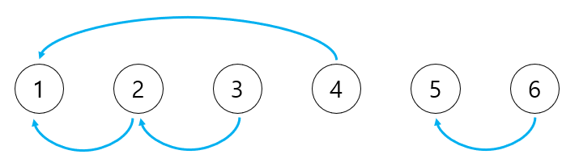

# 그래프 이론

## 서로소 집합

> 서로소 집합(Disjoint Sets): 공통 원소가 없는 두 집합
>
> 서로소 집합 자료구조: 서로소 부분 집합들로 나누어진 원소들의 데이터를 처리하기 위한 자료구조
>
> 서로소 집합 자료구조는 `union`과 `find` 2개의 연산으로 조작할 수 있다.
> 때문에 "union-find 자료구조" 라고 불리기도 한다.

- `union`(합집합) 연산: 2개의 원소가 포함된 집합을 하나의 집합으로 합치는 연산

- `find`(찾기) 연산: 특정한 원소가 속한 집합이 어떤 집합인지 알려주는 연산

### 서로소 집합 자료구조

서로소 집합 자료구조는 트리 자료구조를 이용하여 집합을 표현한다. 서로소 집합 정보(합집합 연산)가 주어졌을 때 트리 자료구조를 이용해 집합을 표현하는 서로소 집합 계산 알고리즘은 다음과 같다.

1. union 연산을 확인하며, 서로 연결된 두 노드 A, B를 확인한다.

   1. A와 B의 루트 노드 `A'`, `B'`을 각각 찾는다.
   2. `A'`을 `B'`의 부모 노드로 설정한다 (`B'`이 `A'`을 가리키도록 한다.)

2. 모든 union 연산을 처리할 때까지 1번 과정을 반복한다.

- 실제로 구현할 때는 `A'`, `B'` 중에서 번호가 작은 원소가 부모 노드가 되도록 구현한다. 또한 "가리킨다"는 표현은 부모 노드로 설정한다는 의미이다.

<details>
  <summary>서로소 집합 계산 알고리즘의 동작 방식</summary>
  
전체 집합 {1, 2, 3, 4, 5, 6}이 6개의 원소로 구성되어 있다.

이 때 다음 4개의 union 연산이 주어진다.

```markdown
- union 1, 4
- union 2, 3
- union 2, 4
- union 5, 6
```

4개의 union 연산이 수행된 후에, 전체 원소들이 결과적으로 어떠한 형태의 부분 집합으로 나누어질 지 확인해보자.

---

union 연산들은 그래프 형태로 표현할 수 있다. 각 원소는 그래프에서의 노드로 표현되고, "같은 집합에 속한다"는 정보를 담은 union 연산들은 간선으로 표현된다.

실제로 각 원소의 집합 정보를 표현하려면 트리 자료구조를 이용하고, 일반적으로 번호가 큰 노드가 번호가 작은 노드를 가리키도록 그림을 그린다. 즉, 트리 구조상 번호가 작은 노드가 부모가 되고, 번호가 큰 노드가 자식이 된다.

다음 그래프는 union의 관계를 효과적으로 보여주기 위해 그래프 형태로 시각화 한 것이다.



전체 원소가 {1, 2, 3, 4}와 {5, 6}의 두 집합으로 나누어 진다.

이렇듯 union 연산으로 그래프를 그리면 "연결성"으로 집합의 형태를 확인할 수 있다.

---

union 연산을 수행한 과정은 다음과 같다.

1. 노드의 개수(V) 크기의 부모 테이블을 초기화 한다. 이때 모든 원소가 자기 자신을 부모로 가지도록 설정한다.

   - 부모 테이블은 특정 노드의 부모에 대해서만 저장하고 있다. 루트 노드를 확인하고자 하면 부모를 재귀적으로 거슬러 올라가서 최종적인 루트 노드를 찾아야 한다.

| 노드 번호 | 1   | 2   | 3   | 4   | 5   | 6   |
| --------- | --- | --- | --- | --- | --- | --- |
| 부모      | 1   | 2   | 3   | 4   | 5   | 6   |

2. `union 1, 4` 연산을 확인하면, 1과 4를 합친다. 노드 1과 노트 4의 루트 노드를 각각 찾아 더 큰 번호의 루트 노드를 작은 번호의 루트 노드로 연결한다. 현재 노드 1과 노드 4의 부모 노드는 각각 1과 4이기 때문에, 노드 4의 부모를 1로 설정한다.

| 노드 번호 | 1   | 2   | 3   | 4   | 5   | 6   |
| --------- | --- | --- | --- | --- | --- | --- |
| 부모      | 1   | 2   | 3   | 1   | 5   | 6   |

3. `union 2, 3` 연산을 확인하면, 2와 3을 합친다. 노드 2와 노드 3의 루트 노드는 각각 2와 3이기 때문에 노드 3의 부모를 2로 설정한다.

| 노드 번호 | 1   | 2   | 3   | 4   | 5   | 6   |
| --------- | --- | --- | --- | --- | --- | --- |
| 부모      | 1   | 2   | 2   | 1   | 5   | 6   |

4. `union 2, 4` 연산을 확인하면, 2와 4를 합친다. 노드 2와 노드 4의 루트 노드는 각각 2와 1이기 때문에 노드 2의 부모를 1로 설정한다.

| 노드 번호 | 1   | 2   | 3   | 4   | 5   | 6   |
| --------- | --- | --- | --- | --- | --- | --- |
| 부모      | 1   | 1   | 2   | 1   | 5   | 6   |

5. `union 5, 6` 연산을 확인하면, 5와 6을 합친다. 노드 5와 노드 6의 루트 노드는 각각 5와 6이기 때문에 노드 6의 부모를 5로 설정한다.

| 노드 번호 | 1   | 2   | 3   | 4   | 5   | 6   |
| --------- | --- | --- | --- | --- | --- | --- |
| 부모      | 1   | 1   | 2   | 1   | 5   | 5   |

</details>

---

[기본적인 서로소 집합 알고리즘 소스코드](./example/ex9_disjoint_sets.py)

```
입력 예시
6 4
1 4
2 3
2 4
5 6

출력 예시
각 원소가 속한 집합: 1 1 1 1 5 5
부모 테이블: 1 1 2 1 5 5
```

출력에서 각 원소가 속한 집합은 각 원소의 루트 노드를 나타내며, 루트 노드가 같은 원소끼리 동일한 집합을 이룬다. 다시 말해 전체 원소가 `{1, 2, 3, 4}`와 `{5, 6}`으로 나누어진다.

위와 같이 구현하면, 답을 구할 수는 있지만 find 함수가 비효율적으로 동작한다. 최악의 경우 find 함수가 모든 노드를 다 확인해야 하고 `O(V)`의 시간이 걸린다.

이러한 find 함수를 경로 압축(Path Compression) 기법으로 최적화 할 수 있다. 경로 압축은 find 함수를 재귀적으로 호출한 뒤에 부모 테이블 값을 갱신하는 기법이다.

기존 find 함수를 다음과 같이 변경한다.

```python
# 경로 압축 기법 소스코드

def find_parent(parent, x):
   if parent[x] != x:
      parent[x] = find_parent(parent, parent[x])
   return parent[x]
```

수정된 함수는 각 노드에 대하여 find 함수를 호출한 이후에, 해당 노드의 루트 노드가 바로 부모 노드가 된다.

결과적으로 경로 압축 기법을 이용하면 루트 노드에 더 빠르게 접근할 수 있고, 시간 복잡도가 개선된다.

### 서로소 집합 알고리즘의 시간 복잡도

경로 압축 방법을 이용한 경우의 시간 복잡도를 알아보자. 노드의 개수가 V개이고, 최대 V-1 개의 union 연산과 M개의 find 연산이 가능할 때 시간 복잡도는 `O(V + M(1 + log_(2 M/V) V))`이다.

### 서로소 집합을 활용한 사이클 판별

서로소 집합은 무방향 그래프 내에서 사이클을 판별할 때 사용할 수 있다. 참고로 방향 그래프에서의 사이클 여부는 DFS를 이용하여 판별할 수 있다.

union 연산은 그래프에서 간선으로 표현될 수 있는데, 간선을 하나씩 확인하면서 두 노드가 포함되어 있는 집합을 합치는 과정을 반복하면 사이클을 판별할 수 있다.

1. 각 간선을 확인하며 두 노드의 루트 노드를 확인한다.

   - 루트 노드가 서로 다르다면 두 노드에 대하여 union 연산을 수행한다.

   - 루트 노드가 서로 같다면 사이클(Cycle)이 발생한다.

2. 그래프에 포함되어 있는 모든 간선에 대하여 1번 과정을 반복한다.

[사이클 판별 소스코드](./example/ex9_disjoint_cycle.py)

```
입력 예시
3 3
1 2
1 3
2 3
```
