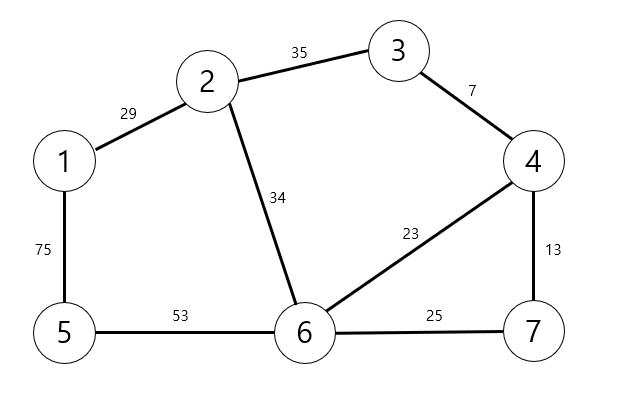
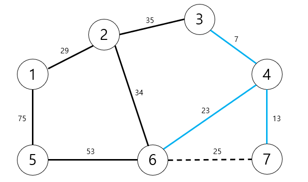
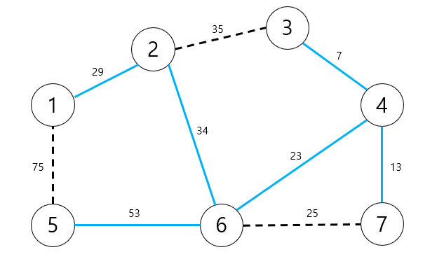

# 그래프 이론

## 신장 트리(Spanning Tree)

> 하나의 그래프가 있을 때 모든 노드를 포함하면서 사이클이 존재하지 않는 부분 그래프

이때 "모든 노드가 포함되어 서로 연결되면서 사이클이 존재하지 않는다"는 조건은 트리의 성립 조건이기도 하다.

## 크루스칼 알고리즘(Kruskal Algorithm)

> 대표적인 최소 신장 트리 알고리즘
>
> 최소 신장 트리 알고리즘: 신장 트리 중에서 최소 비용으로 만들 수 있는 신장 트리를 찾는 알고리즘

크루스칼 알고리즘을 사용하면 가장 적은 비용으로 모든 노드를 연결할 수 있고, 그리디 알고리즘으로 분류된다.

1. 간선 데이터를 비용에 따라 오름차순으로 정렬한다.

2. 간선을 하나씩 확인하며 현재의 간선이 사이클을 발생시키는 지 확인한다.

   - 사이클이 발생하지 않는 경우 최소 신장 트리에 포함시킨다.

   - 사이클이 발생하는 경우 최소 신장 트리에 포함시키지 않는다.

3. 모든 간선에 대하여 2번의 과정을 반복한다.

- 최소 신장 트리는 일종의 트리(Tree) 자료구조이므로, 최종적으로 포함되는 간선의 개수가 "노드의 개수 - 1"과 같다.

<details>
  <summary>크루스칼 알고리즘 단계</summary>



1. 그래프의 모든 간선 정보만 따로 빼내어 정렬을 수행한다. 맨 처음에는 전체 그래프에 존재하는 모든 간선을 정렬한다. 실제로는 전체 간선 데이터를 리스트에 담은 뒤 정렬하지만, 가독성을 위해 노드 데이터 순서에 따라 테이블 내에 데이터를 나열한다.

| 간선 | (1, 2) | (1, 5) | (2, 3) | (2, 6) | (3, 4) | (4, 6) | (4, 7) | (5, 6) | (6, 7) |
| ---- | ------ | ------ | ------ | ------ | ------ | ------ | ------ | ------ | ------ |
| 비용 | 29     | 75     | 35     | 34     | 7      | 23     | 13     | 53     | 25     |

2. 첫 번째 단계ㅖ에서는 가장 짧은 간선을 선택한다. 따라서 (3, 4)가 선택되고 이것을 집합에 포함한다. 즉, 노드 3과 노드 4에 대하여 union 함수를 수행한다.

| 간선 | (1, 2) | (1, 5) | (2, 3) | (2, 6) | (3, 4) | (4, 6) | (4, 7) | (5, 6) | (6, 7) |
| ---- | ------ | ------ | ------ | ------ | ------ | ------ | ------ | ------ | ------ |
| 비용 | 29     | 75     | 35     | 34     | 7      | 23     | 13     | 53     | 25     |
| 순서 |        |        |        |        | step 1 |        |        |        |        |

3. 그 다음으로 비용이 가장 적은 간선인 (4, 7)을 선택한다. 현재 노드 4와 노드 7은 같은 집합에 속해 있지 않기 때문에 union 함수를 수행한다.

| 간선 | (1, 2) | (1, 5) | (2, 3) | (2, 6) | (3, 4) | (4, 6) | (4, 7) | (5, 6) | (6, 7) |
| ---- | ------ | ------ | ------ | ------ | ------ | ------ | ------ | ------ | ------ |
| 비용 | 29     | 75     | 35     | 34     | 7      | 23     | 13     | 53     | 25     |
| 순서 |        |        |        |        | step 1 |        | step 2 |        |        |

4. 그 다음으로 비용이 가장 적은 간선인 (4, 6)을 선택한다. 현재 노드 4와 노드 6은 같은 집합에 속해 있지 않기 때문에 union 함수를 수행한다.

| 간선 | (1, 2) | (1, 5) | (2, 3) | (2, 6) | (3, 4) | (4, 6) | (4, 7) | (5, 6) | (6, 7) |
| ---- | ------ | ------ | ------ | ------ | ------ | ------ | ------ | ------ | ------ |
| 비용 | 29     | 75     | 35     | 34     | 7      | 23     | 13     | 53     | 25     |
| 순서 |        |        |        |        | step 1 | step 3 | step 2 |        |        |

5. 그 다음으로 비용이 가장 작은 간선인 (6, 7)을 선택한다. 선택된 노드 6과 노드 7의 루트 노드를 확인한다. 이미 동일한 집합에 포함되어 있으므로 신장 트리에 포함하지 않는다.
   

| 간선 | (1, 2) | (1, 5) | (2, 3) | (2, 6) | (3, 4) | (4, 6) | (4, 7) | (5, 6) | ~~(6, 7)~~ |
| ---- | ------ | ------ | ------ | ------ | ------ | ------ | ------ | ------ | ---------- |
| 비용 | 29     | 75     | 35     | 34     | 7      | 23     | 13     | 53     | ~~25~~     |
| 순서 |        |        |        |        | step 1 | step 3 | step 2 |        | ~~step 4~~ |

6. 그 다음 비용이 가장 작은 간선 (1, 2)를 선택한다. 노드 1과 노드 2는 같은 집합에 속해있지 않기 때문에, union 함수를 수행한다.

| 간선 | (1, 2) | (1, 5) | (2, 3) | (2, 6) | (3, 4) | (4, 6) | (4, 7) | (5, 6) | ~~(6, 7)~~ |
| ---- | ------ | ------ | ------ | ------ | ------ | ------ | ------ | ------ | ---------- |
| 비용 | 29     | 75     | 35     | 34     | 7      | 23     | 13     | 53     | ~~25~~     |
| 순서 | step 5 |        |        |        | step 1 | step 3 | step 2 |        | ~~step 4~~ |

7. 그 다음 비용이 가장 작은 간선 (2, 6)를 선택한다. 노드 2와 노드 6은 같은 집합에 속해있지 않기 때문에, union 함수를 수행한다.

| 간선 | (1, 2) | (1, 5) | (2, 3) | (2, 6) | (3, 4) | (4, 6) | (4, 7) | (5, 6) | ~~(6, 7)~~ |
| ---- | ------ | ------ | ------ | ------ | ------ | ------ | ------ | ------ | ---------- |
| 비용 | 29     | 75     | 35     | 34     | 7      | 23     | 13     | 53     | ~~25~~     |
| 순서 | step 5 |        |        | step 6 | step 1 | step 3 | step 2 |        | ~~step 4~~ |

8. 그 다음 비용이 가장 작은 간선 (2, 3)를 선택한다. 노드 2와 노드 3은 이미 동일한 집합에 포함되어 있으므로 union 함수를 호출하지 않는다.

| 간선 | (1, 2) | (1, 5) | ~~(2, 3)~~ | (2, 6) | (3, 4) | (4, 6) | (4, 7) | (5, 6) | ~~(6, 7)~~ |
| ---- | ------ | ------ | ---------- | ------ | ------ | ------ | ------ | ------ | ---------- |
| 비용 | 29     | 75     | ~~35~~     | 34     | 7      | 23     | 13     | 53     | ~~25~~     |
| 순서 | step 5 |        | ~~step 7~~ | step 6 | step 1 | step 3 | step 2 |        | ~~step 4~~ |

9. 그 다음 비용이 가장 작은 간선 (5, 6)를 선택한다. 노드 5와 노드 6은 같은 집합에 속해있지 않기 때문에, union 함수를 수행한다.

| 간선 | (1, 2) | (1, 5) | ~~(2, 3)~~ | (2, 6) | (3, 4) | (4, 6) | (4, 7) | (5, 6) | ~~(6, 7)~~ |
| ---- | ------ | ------ | ---------- | ------ | ------ | ------ | ------ | ------ | ---------- |
| 비용 | 29     | 75     | ~~35~~     | 34     | 7      | 23     | 13     | 53     | ~~25~~     |
| 순서 | step 5 |        | ~~step 7~~ | step 6 | step 1 | step 3 | step 2 | step 8 | ~~step 4~~ |

10. 그 다음 비용이 가장 작은 간선 (1, 5)를 선택한다. 노드 1과 노드 5는 이미 동일한 집합에 포함되어 있으므로 union 함수를 호출하지 않는다.

| 간선 | (1, 2) | ~~(1, 5)~~ | ~~(2, 3)~~ | (2, 6) | (3, 4) | (4, 6) | (4, 7) | (5, 6) | ~~(6, 7)~~ |
| ---- | ------ | ---------- | ---------- | ------ | ------ | ------ | ------ | ------ | ---------- |
| 비용 | 29     | ~~75~~     | ~~35~~     | 34     | 7      | 23     | 13     | 53     | ~~25~~     |
| 순서 | step 5 | ~~step 9~~ | ~~step 7~~ | step 6 | step 1 | step 3 | step 2 | step 8 | ~~step 4~~ |

결과적으로 다음과 같은 최소 신장 트리를 찾을 수 있다. 또한 최소 신장 트리에 포함되어 있는 간선의 비용을 모두 더하면, 그 값이 최종 비용에 해당한다.



</details>

[크루스칼 알고리즘 소스코드](./example/ex9_kruskal.py)

```
입력 예시
7 9
1 2 29
1 5 75
2 3 35
2 6 34
3 4 7
4 6 23
4 7 13
5 6 53
6 7 25

출력 예시
159
```

### 크루스칼 알고리즘의 시간 복잡도

간선의 개수가 E개일 때, `O(ElogE)`의 시간 복잡도를 가진다.

크루스칼 알고리즘에서 가장 오래 걸리는 부분은 간선을 정렬하는 작업이며, E개의 데이터를 정렬할 때 `O(ElogE)`의 시간 복잡도를 가진다.

크루스칼 내부에서 사용되는 서로소 집합 알고리즘의 시간 복잡도는 정렬 알고리즘의 시간 복잡도보다 작으므로 무시한다.
