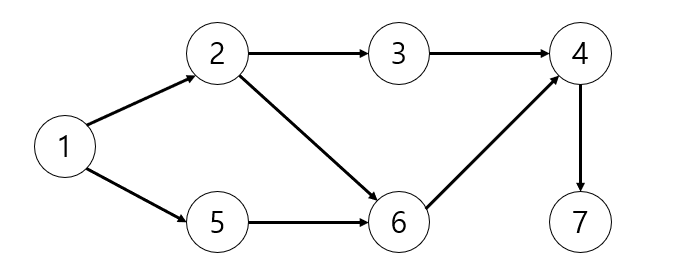

# 그래프 이론

## 위상 정렬(Topology Sort)

> 순서가 정해져 있는 일련의 작업을 차례대로 수행해야 할 때 사용할 수 있는 알고리즘
>
> 방향 그래프의 모든 노드를 방향성에 거스르지 않도록 순서대로 나열하는 것

- 진입 차수(in-degree): 특정한 노드로 들어오는 간선의 개수

1. 진입 차수가 0인 노드를 큐에 넣는다.

2. 큐가 빌 때까지 다음 과정을 반복한다.

   1. 큐에서 원소를 꺼내 해당 노드에서 출발하는 간선을 그래프에서 제거한다.

   2. 새롭게 진입 차수가 0이 된 노드를 큐에 넣는다.

- 이 때 모든 원소를 방문하기 전에 큐가 빈다면 사이클이 존재한다고 판단할 수 있다.

- 기본적으로 위상정렬 문제에서는 사이클이 발생하지 않는다고 명시하는 경우가 많으므로, 다음 예제에서는 사이클이 발생하는 경우는 고려하지 않는다.

<details>
    <summary>위상 정렬 수행 과정</summary>



1. 집입 차수가 0인 노드를 큐에 넣는다. 현재 노드 1의 진입차수만 0이기 때문에 큐에 노드 1을 삽입한다.

| 노드      | 1   | 2   | 3   | 4   | 5   | 6   | 7   |
| --------- | --- | --- | --- | --- | --- | --- | --- |
| 진입 차수 | 0   | 1   | 1   | 2   | 1   | 2   | 1   |

| 큐  | 노드 1 |
| --- | ------ |

2. 먼저 큐에 들어있는 노드 1을 꺼낸다. 노드 1과 연결되어 있는 간선들을 제거한다. 그러면 노드 2와 노드 5의 진입차수가 0이 된다. 따라서 노드 2와 노드 5를 큐에 삽입한다.

| 노드      | 1   | 2   | 3   | 4   | 5   | 6   | 7   |
| --------- | --- | --- | --- | --- | --- | --- | --- |
| 진입 차수 | 0   | 0   | 1   | 2   | 0   | 2   | 1   |

| 큐  | 노드 2, 노드 5 |
| --- | -------------- |

3. 그 다음 큐에 들어있는 노드 2를 꺼낸다. 노드 2와 연결되어 있는 간선들을 제거한다. 그러면 노드 3의 진입차수가 0이 된다. 따라서 노드 3을 큐에 삽입한다.

| 노드      | 1   | 2   | 3   | 4   | 5   | 6   | 7   |
| --------- | --- | --- | --- | --- | --- | --- | --- |
| 진입 차수 | 0   | 0   | 0   | 2   | 0   | 2   | 1   |

| 큐  | 노드 5, 노드 3 |
| --- | -------------- |

4. 큐에 들어있는 노드 5를 꺼내고 연결되어 있는 간선들을 제거한다. 그러면 노드 6의 진입차수가 0이 된다. 따라서 노드 6을 큐에 삽입한다.

| 노드      | 1   | 2   | 3   | 4   | 5   | 6   | 7   |
| --------- | --- | --- | --- | --- | --- | --- | --- |
| 진입 차수 | 0   | 0   | 0   | 2   | 0   | 0   | 1   |

| 큐  | 노드 3, 노드 6 |
| --- | -------------- |

5. 큐에 들어있는 노드 3을 꺼내고 연결되어 있는 간선들을 제거한다. 새롭게 진입차수가 0이 되는 노드가 없으므로 넘어간다.

| 노드      | 1   | 2   | 3   | 4   | 5   | 6   | 7   |
| --------- | --- | --- | --- | --- | --- | --- | --- |
| 진입 차수 | 0   | 0   | 0   | 2   | 0   | 0   | 1   |

| 큐  | 노드 6 |
| --- | ------ |

6. 큐에 들어있는 노드 6을 꺼내고 연결되어 있는 간선들을 제거한다. 노드 4의 진입차수가 0이 되므로 큐에 삽입한다.

| 노드      | 1   | 2   | 3   | 4   | 5   | 6   | 7   |
| --------- | --- | --- | --- | --- | --- | --- | --- |
| 진입 차수 | 0   | 0   | 0   | 0   | 0   | 0   | 1   |

| 큐  | 노드 4 |
| --- | ------ |

7. 큐에 들어있는 노드 4를 꺼내고 연결되어 있는 간선들을 제거한다. 노드 7의 진입차수가 0이 되므로 큐에 삽입한다.

| 노드      | 1   | 2   | 3   | 4   | 5   | 6   | 7   |
| --------- | --- | --- | --- | --- | --- | --- | --- |
| 진입 차수 | 0   | 0   | 0   | 0   | 0   | 0   | 0   |

| 큐  | 노드 7 |
| --- | ------ |

8. 큐에 들어있는 노드 7을 꺼내고 연결되어 있는 간선들을 제거한다. 새롭게 진입차수가 0이 되는 노드가 없으므로 넘어간다.

| 노드      | 1   | 2   | 3   | 4   | 5   | 6   | 7   |
| --------- | --- | --- | --- | --- | --- | --- | --- |
| 진입 차수 | 0   | 0   | 0   | 0   | 0   | 0   | 0   |

| 큐  |     |
| --- | --- |

- 위 과정을 수행하는 동안 큐에서 빠져나간 노드를 순서대로 출력하면, 위상 정렬을 수행한 결과가 된다. 만약 한 단계에서 큐에 들어가는 원소가 2개 이상이라면, 위상 정렬의 답안은 여러 가지가 될 수 있다

</details>

---

[위상 정렬 소스코드](./example/ex9_topology_sort.py)

```
입력 예시
7 8
1 2
1 5
2 3
2 6
3 4
4 7
5 6
6 4
```

### 위상 정렬의 시간 복잡도

위상 정렬의 시간 복잡도는 `O(V+E)`이다. 위상 정렬을 수행할 때는 차례대로 모든 노드를 확인하면서, 해당 노드에서 출발하는 간선을 차례대로 제거한다. 결과적으로 노드와 간선을 모두 확인하므로 `O(V+E)`의 시간이 소요된다.
