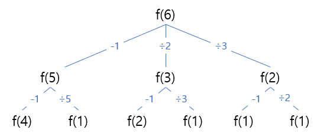

# 다이나믹 프로그래밍

## 1로 만들기

정수 X가 주어질 때 정수 X에 사용할 수 있는 연산은 다음 4가지이다.

1. X가 5로 나누어떨어지면, 5로 나눈다

2. X가 3으로 나누어떨어지면, 3으로 나눈다

3. X가 2로 나누어떨어지면, 2로 나눈다

4. X에서 1을 뺀다.

연산 4개를 적절히 사용해 1을 만들때, 연산을 사용하는 횟수의 최솟값을 출력하라.

입력 조건

- 첫쨰 줄에 정수 X가 주어진다. (1 <= X <= 30,000)

출력 조건

- 첫째 줄에 연산을 하는 횟수의 최솟값을 출력한다.

```
입력 예시
26
```

```
출력 예시
3
```

---

### [문제 풀이](./7-1.py)

### 문제 해설

함수가 호출되는 과정을 그려보면, 동일한 함수가 여러 번 호출되는 것을 알 수 있다.



식으로 표현하면 `f(6) = min(f(5), f(3), f(2)) + 1`

함수의 호출 횟수를 구하기 위해 `+1`을 추가한다.

일반화 한다면 `f(n) = min(f(n-1), f(n//5), f(n//3), f(n//2)) + 1`

n이 1이면, 더 이상 계산하지 않으므로 `d[1] = 0`이고, 반복문은 2부터 X까지 계산한다.

더 작은 수는 `min()` 함수를 이용해 구할 수 있다.
